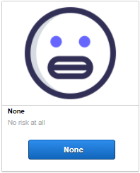
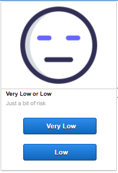
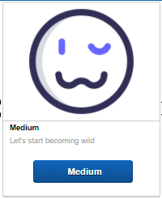
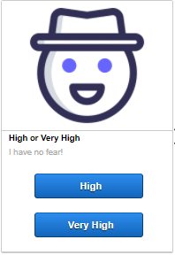
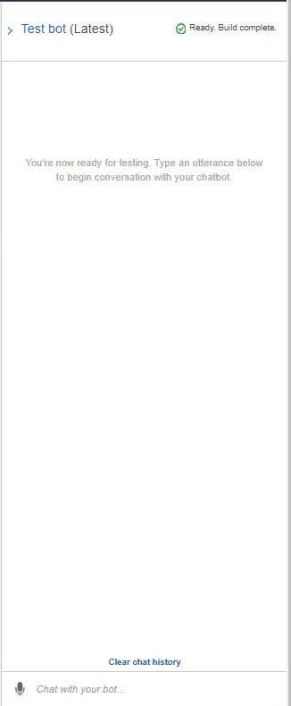

# unit13_roboadvisor

 To demonstrate capabilities and usage of cloud computing services, I chose to design the **Robo Advisor for Retirement Plans** (that interconnects two of the Amazon cloud services: Amazon Lex and Amazon Lambda function).

The objective on this challenge was to create a Robo Financial Advisor that would recommend a portfolio selection based on the risk comfort level of the client as long as the age and the investment amount were between acceptable threholds (for age: between 0 and 65 and for investment amount minimum 5000).

The Robo Advisor interacts with the user and requests information to determine the recommendation. The information requested are: name, age of the user, Investment amount and Risk Level).

To requests the risk level the Robo Advisor presents four prompt response cards, explaining the each risk level category along with representative icons so that the user can visibly grasp the risk-level. 

Icons are stored in Amazon bucket S3, which once it's publicly available, can be called upon with their URL.

The four prompt response cards are presented in table 1.

  Table 1 

<table>
  <tr>
    <td>Risk Level None</td>
     <td>Risk Level Very Low or Low</td>
     <td>Risk Level Medium</td>
     <td>Risk Level High or Very High</td>
  </tr>
  <tr>
    <td></td>
    <td></td>
    <td></td>
    <td></td>
  </tr>
</table>

## Results - Interaction with the Robot Advisor:

___
### Resources

Icons were supplied by iconfinder (https://iconfinder.com)

Robo Images are license free photos provided by the authors:

[1] (https://unsplash.com/photos/HuE1cJo-x34?utm_source=unsplash&utm_medium=referral&utm_content=creditShareLink)

[2] (https://unsplash.com/photos/K21Dn4OVxNw?utm_source=unsplash&utm_medium=referral&utm_content=creditShareLink)

